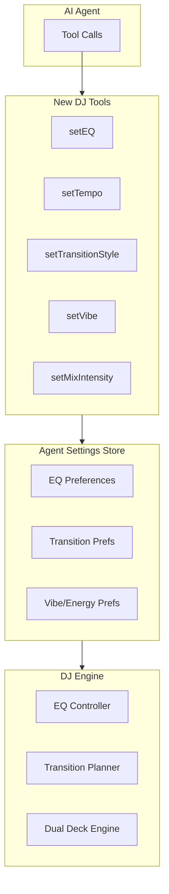

# DJ Agent Knobs

## Overview

Extend the AI agent's capabilities from just track selection to full DJ mixer control. The agent will have both:

- **Direct controls**: Explicit tool calls for EQ, tempo, transition settings
- **Declarative presets**: High-level intents like "build energy" or "smooth transition"

## Architecture




## New Tools for AI Agent

### Direct Control Tools

| Tool | Parameters | Description ||------|------------|-------------|| `setEQ` | `deck`, `low`, `mid`, `high` (0-1) | Adjust 3-band EQ on active/cued deck || `setTempo` | `adjustment` (-8% to +8%) | Adjust playback rate for tempo matching || `setFilter` | `type`, `frequency`, `resonance` | HPF/LPF filter sweep || `setTransitionStyle` | `eqPreset`, `durationBars`, `phraseBars` | Configure next transition |

### Declarative/Preset Tools

| Tool | Parameters | Description ||------|------------|-------------|| `setVibe` | `direction`: "build", "maintain", "wind_down", "peak" | Set energy trajectory || `setMixIntensity` | `level`: "smooth", "normal", "aggressive" | How dramatic transitions should be || `setHarmonicMode` | `mode`: "strict", "flexible", "off" | Key matching enforcement |

## Implementation Files

### 1. Types: `lib/dj/agent/types.ts`

New types for agent-controlled settings:

```typescript
export interface AgentEQSettings {
  low: Normalized;
  mid: Normalized;
  high: Normalized;
}

export interface AgentTransitionSettings {
  eqPreset: 'bassSwap' | 'frequencySplit' | 'smooth' | 'highFirst';
  durationBars: number;     // 4, 8, 16, 32
  phraseBars: number;       // Alignment boundary
}

export type VibeDirection = 'build' | 'maintain' | 'wind_down' | 'peak';
export type MixIntensity = 'smooth' | 'normal' | 'aggressive';
export type HarmonicMode = 'strict' | 'flexible' | 'off';

export interface AgentDJSettings {
  eq: { deckA: AgentEQSettings; deckB: AgentEQSettings };
  transition: AgentTransitionSettings;
  vibe: VibeDirection;
  intensity: MixIntensity;
  harmonicMode: HarmonicMode;
  tempoAdjustment: number;  // -0.08 to +0.08
}
```


### 2. Store: `lib/dj/agent/store.ts`

Zustand store for agent settings (separate from player store):

```typescript
export const useAgentDJStore = create<AgentDJStore>()((set) => ({
  settings: DEFAULT_AGENT_SETTINGS,
  actions: {
    setEQ: (deck, bands) => set(...),
    setTransitionStyle: (style) => set(...),
    setVibe: (direction) => set(...),
    // ...
  }
}));
```


### 3. Tool Definitions: Update `app/api/chat/route.ts`

Add new tools to the AI agent:

```typescript
const tools: ToolSet = {
  player: { /* existing */ },
  
  // Direct controls
  setEQ: {
    description: "Adjust 3-band EQ on a deck",
    inputSchema: z.object({
      deck: z.enum(['active', 'cued']),
      low: z.number().min(0).max(1).optional(),
      mid: z.number().min(0).max(1).optional(),
      high: z.number().min(0).max(1).optional(),
    })
  },
  
  setTransitionStyle: {
    description: "Configure how the next transition will sound",
    inputSchema: z.object({
      preset: z.enum(['bassSwap', 'frequencySplit', 'smooth', 'highFirst']),
      durationBars: z.number().int().min(4).max(64).optional(),
    })
  },
  
  // Declarative controls
  setVibe: {
    description: "Set the energy direction for upcoming tracks",
    inputSchema: z.object({
      direction: z.enum(['build', 'maintain', 'wind_down', 'peak']),
    })
  },
  
  setMixIntensity: {
    description: "Control how dramatic transitions should be",
    inputSchema: z.object({
      level: z.enum(['smooth', 'normal', 'aggressive']),
    })
  },
};
```


### 4. Tool Handler: `components/music-player/chat/useRevibeChat.ts`

Extend `onToolCall` to handle new DJ tools:

```typescript
onToolCall: async (ctx) => {
  const { toolName, input } = ctx.toolCall;
  
  if (toolName === 'setEQ') {
    agentDJStore.getState().actions.setEQ(input.deck, input);
    return `EQ adjusted on ${input.deck} deck`;
  }
  
  if (toolName === 'setVibe') {
    agentDJStore.getState().actions.setVibe(input.direction);
    return `Vibe set to ${input.direction}`;
  }
  // ...
}
```


### 5. Engine Integration: Update `useDJEngine.ts`

Subscribe to agent settings and apply them:

```typescript
// In useDJEngine or new useAgentDJControls hook
useEffect(() => {
  const unsub = useAgentDJStore.subscribe((state) => {
    // Apply EQ settings to active EQ controller
    // Apply transition settings to planner
    // Adjust tempo if needed
  });
  return unsub;
}, []);
```


### 6. System Prompt Update: `lib/ai.ts`

Inform the agent about new DJ controls:

```typescript
// Add to systemMessage
`
DJ MIXING CONTROLS:
You have access to DJ mixer controls beyond just track selection:

- setEQ: Adjust bass/mid/treble. Use to emphasize or reduce frequencies.
  Example: Cut bass on outgoing track before transition with setEQ({deck: 'active', low: 0.3})
  
- setTransitionStyle: Control how transitions sound.
  Presets: bassSwap (swap bass at midpoint), smooth (gradual all bands), 
           frequencySplit (complementary EQ), highFirst (bring in highs first)
  
- setVibe: Set energy direction for the set.
  build = increasing intensity, wind_down = decreasing, peak = maximum energy
  
- setMixIntensity: How dramatic should mixes be?
  smooth = long subtle transitions, aggressive = quick dramatic cuts

Use these to create professional DJ sets, not just playlists.
`
```


## Integration with Existing Architecture

The agent settings will flow through the existing DJ infrastructure:

- **EQ settings** -> `EQController` in [lib/dj/eq/controller.ts](lib/dj/eq/controller.ts)
- **Transition settings** -> `TransitionPlanOptions` in [lib/dj/engine/types.ts](lib/dj/engine/types.ts)
- **Vibe/intensity** -> Influences transition planner scoring in [lib/dj/engine/transitionPlanner.ts](lib/dj/engine/transitionPlanner.ts)

## Directory Structure

```javascript
lib/dj/agent/
  types.ts        # AgentDJSettings, VibeDirection, etc.
  store.ts        # useAgentDJStore
  defaults.ts     # DEFAULT_AGENT_SETTINGS
  index.ts        # Public exports


```