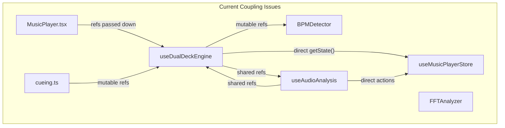
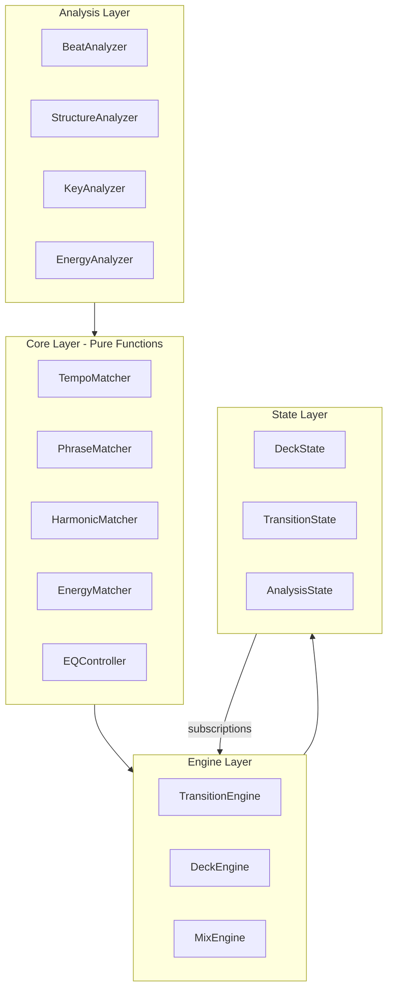
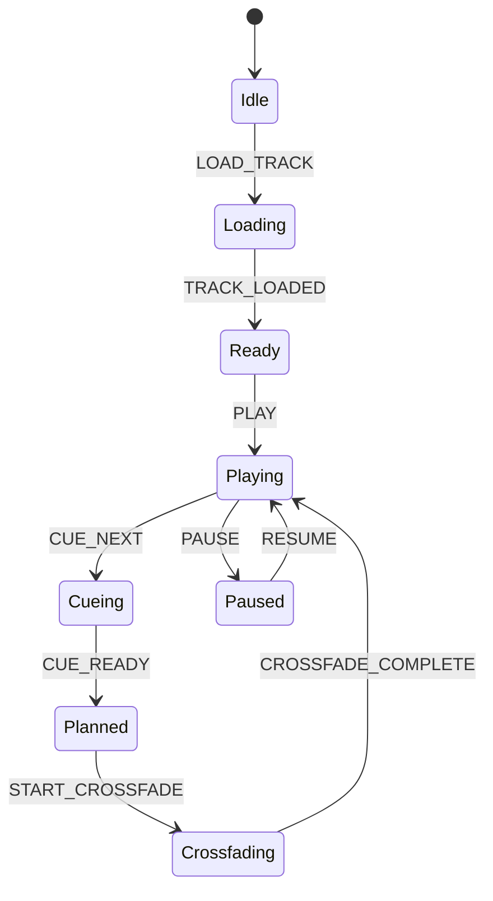

# DJ Transition System Architecture Redesign

## Current Architecture Problems

### Implicit Coupling Analysis



**Problems identified:**

1. **Ref-based implicit state**: `crossfadeInProgressRef`, `waitingForBeatRef`, `nextTrackReadyRef` are shared mutable refs across hooks creating hidden dependencies
2. **Direct store access**: `useMusicPlayerStore.getState()` called inside callbacks bypasses React's reactivity and creates tight coupling
3. **Callback threading**: `onRevibeRef` pattern threads callbacks through multiple layers without clear contracts
4. **Mixed concerns**: `handleTimeUpdate` (800+ lines file) mixes playback control, transition planning, auto-revibe scheduling, and analysis publishing

### Non-Deterministic Boundaries

| Boundary | Current Behavior | Problem |

|----------|------------------|---------|

| Crossfade timing | `epsilon = 0.25` tolerance + `requestAnimationFrame` | Frame-rate dependent, varies 16-60+ fps |

| Beat detection | Threshold-based (`> 0.6`) | Energy varies by track mastering |

| Phase alignment | `getTimeToNextBeat()` with 60ms window | No tempo adjustment, phase drift accumulates |

| Transition trigger | Multiple OR conditions with magic numbers | Non-reproducible decision tree |

### Cyclomatic Complexity (estimated)

- `handleTimeUpdate`: ~18 decision branches
- `crossfadeToCuedTrack`: ~12 branches  
- `cueTrackOnDeck`: ~8 branches
- `classifySection`: ~6 branches

---

## Proposed Architecture



### Layer Contracts

Each layer has explicit input/output types with no hidden dependencies:

```typescript
// Core Layer - Pure, testable functions
interface TempoMatcher {
  calculateTempoRatio(sourceBpm: number, targetBpm: number): TempoRatio;
  getPhaseOffset(sourcePhase: number, targetPhase: number, barDuration: number): PhaseOffset;
}

interface TransitionPlan {
  readonly startBoundary: BeatBoundary;
  readonly crossfadeDuration: Duration;
  readonly tempoAdjustment: TempoRatio;
  readonly phaseOffset: PhaseOffset;
  readonly eqCurve: EQCurve;
  readonly harmonicCompatibility: HarmonicScore;
}
```

---

## Feature Implementation

### 1. Beatmatching (Tempo and Phase Alignment)

**Current state**: BPM detection only, no tempo adjustment

**New design**:

```typescript
// lib/dj/tempo/matcher.ts
interface TempoMatchResult {
  targetPlaybackRate: number;      // 0.92 - 1.08 typical range
  phaseOffsetMs: number;           // Time to delay/advance for phase lock
  confidence: number;              // 0-1 match quality
}

// Deterministic: given same inputs, always same outputs
function matchTempo(
  source: BeatGrid,
  target: BeatGrid,
  constraints: TempoConstraints
): TempoMatchResult;
```

**Files to create**:

- `lib/dj/tempo/types.ts` - BeatGrid, TempoConstraints, TempoMatchResult
- `lib/dj/tempo/matcher.ts` - Pure matching functions
- `lib/dj/tempo/beatgrid.ts` - Beat grid construction from analysis

### 2. Phrase Matching (Structural Alignment)

**Current state**: Naive 16-bar boundaries based on elapsed time

**New design**:

```typescript
// lib/dj/structure/types.ts
interface Phrase {
  startBeat: number;
  lengthBars: number;
  type: 'intro' | 'verse' | 'buildup' | 'drop' | 'breakdown' | 'outro';
  energy: number;
}

interface StructureMap {
  phrases: Phrase[];
  downbeats: number[];    // Timestamps of phrase starts
  sections: Section[];
}

// lib/dj/structure/analyzer.ts
function analyzeStructure(
  energyCurve: Float32Array,
  beatGrid: BeatGrid,
  duration: number
): StructureMap;
```

**Key insight**: Phrase boundaries should be detected from energy contours, not guessed from time offsets.

### 3. EQ Control and Volume Management

**Current state**: HPF/LPF filters during crossfade only

**New design**:

```typescript
// lib/dj/eq/types.ts
interface EQBand {
  low: number;     // 20-250 Hz
  mid: number;     // 250-4000 Hz  
  high: number;    // 4000-20000 Hz
}

interface EQCurve {
  duration: number;
  outgoing: EQKeyframe[];   // Kill bass first, then mids
  incoming: EQKeyframe[];   // Bring in highs, then mids, then bass
}

// lib/dj/eq/controller.ts
class EQController {
  constructor(audioContext: AudioContext);
  
  applyToNode(source: AudioNode): EQNodes;
  setCurve(curve: EQCurve): void;
  tick(progress: number): void;  // 0-1 crossfade progress
}
```

**Mix techniques to implement**:

- Bass swap (kill outgoing bass at phrase, bring in incoming)
- Frequency splitting (complementary EQ during overlap)
- Volume compensation (avoid clipping during overlap)

### 4. Harmonic Compatibility (Key Matching)

**Current state**: `key_signature` field exists but unused

**New design**:

```typescript
// lib/dj/harmonic/types.ts
type CamelotKey = '1A' | '1B' | '2A' | ... | '12B';

interface HarmonicScore {
  compatibility: number;          // 0-1
  relationship: 'same' | 'perfect5th' | 'relative' | 'parallel' | 'clash';
  suggestedPitchShift: number;   // Semitones, -2 to +2
}

// lib/dj/harmonic/camelot.ts
function parseKey(keySignature: string): CamelotKey | null;
function getCompatibility(source: CamelotKey, target: CamelotKey): HarmonicScore;
```

**Camelot wheel rules**:

- Same key: Perfect (1.0)
- +/- 1 on wheel: Great (0.9)
- +/- 7 (relative major/minor): Good (0.8)
- Same number different letter: Acceptable (0.7)

### 5. Energy and Track Selection

**Current state**: Basic section classification with thresholds

**New design**:

```typescript
// lib/dj/energy/types.ts
interface EnergyCurve {
  samples: Float32Array;     // Normalized 0-1
  sampleRate: number;        // Samples per second
  peaks: number[];           // Indices of energy peaks
  valleys: number[];         // Indices of energy valleys
}

interface TransitionScore {
  energyMatch: number;       // How well energy curves connect
  momentumMatch: number;     // Rising->rising, falling->falling
  contrastScore: number;     // Variety vs monotony
}

// lib/dj/energy/selector.ts
function scoreTransition(
  outgoingCurve: EnergyCurve,
  outgoingExitPoint: number,
  incomingCurve: EnergyCurve,
  incomingEntryPoint: number
): TransitionScore;
```

---

## State Machine Redesign

Replace the current implicit state with an explicit finite state machine:


```typescript
// lib/dj/engine/stateMachine.ts
type DJState = 
  | { type: 'idle' }
  | { type: 'loading'; trackId: number }
  | { type: 'ready'; deck: DeckState }
  | { type: 'playing'; deck: DeckState; analysis: AnalysisSnapshot }
  | { type: 'cueing'; activeDeck: DeckState; cueDeck: DeckState }
  | { type: 'planned'; plan: TransitionPlan }
  | { type: 'crossfading'; plan: TransitionPlan; progress: number }
  | { type: 'paused'; deck: DeckState };

type DJEvent = 
  | { type: 'LOAD_TRACK'; trackId: number }
  | { type: 'TRACK_LOADED'; deck: DeckState }
  | { type: 'PLAY' }
  | { type: 'PAUSE' }
  | { type: 'CUE_NEXT'; track: Track }
  | { type: 'CUE_READY'; deck: DeckState }
  | { type: 'PLAN_TRANSITION'; plan: TransitionPlan }
  | { type: 'START_CROSSFADE' }
  | { type: 'CROSSFADE_TICK'; progress: number }
  | { type: 'CROSSFADE_COMPLETE' };

// Pure reducer - deterministic transitions
function djReducer(state: DJState, event: DJEvent): DJState;
```

---

## Directory Structure

```
lib/
  dj/
    types.ts                 # Shared types across all modules
    index.ts                 # Public API exports
    
    tempo/
      types.ts               # BeatGrid, TempoConstraints
      matcher.ts             # matchTempo()
      beatgrid.ts            # constructBeatGrid()
      phase.ts               # Phase alignment utilities
    
    structure/
      types.ts               # Phrase, Section, StructureMap
      analyzer.ts            # analyzeStructure()
      detector.ts            # Phrase boundary detection
    
    harmonic/
      types.ts               # CamelotKey, HarmonicScore
      camelot.ts             # Key parsing, compatibility
      keyDetector.ts         # Optional: runtime key detection
    
    energy/
      types.ts               # EnergyCurve, TransitionScore
      analyzer.ts            # Energy curve extraction
      selector.ts            # scoreTransition()
    
    eq/
      types.ts               # EQBand, EQCurve
      controller.ts          # EQController class
      curves.ts              # Preset transition curves
    
    engine/
      types.ts               # DJState, DJEvent
      stateMachine.ts        # djReducer
      transitionPlanner.ts   # Plan computation
      mixEngine.ts           # Actual audio routing

components/
  music-player/
    engine/
      useDJEngine.ts         # New hook replacing useDualDeckEngine
      useTransitionPlanner.ts
    store/
      djStore.ts             # New store with proper slices
```

---

## Migration Path

### Phase 1: Foundation (Non-Breaking)

1. Create `lib/dj/` directory with pure types and functions
2. Add unit tests for all pure functions
3. Implement Camelot wheel (harmonic matching)

### Phase 2: Analysis Layer

1. Build `BeatGridAnalyzer` wrapping existing BPMDetector
2. Create `StructureAnalyzer` for phrase detection
3. Add `EnergyAnalyzer` for curve extraction

### Phase 3: Engine Layer

1. Create new `djReducer` state machine
2. Build `TransitionPlanner` using pure functions
3. Implement `EQController` for 3-band mixing

### Phase 4: Integration

1. Create `useDJEngine` hook using new architecture
2. Migrate `MusicPlayer.tsx` to new hook
3. Deprecate old `useDualDeckEngine`

---

## Correctness Guarantees

| Boundary | Guarantee | Implementation |

|----------|-----------|----------------|

| State transitions | Deterministic | Pure reducer, exhaustive pattern matching |

| Tempo matching | Bounded | Clamp playback rate to 0.92-1.08 |

| Phase alignment | Quantized | Snap to beat grid, no floating-point drift |

| EQ curves | Monotonic | Keyframe interpolation with constraints |

| Energy matching | Normalized | All values 0-1, explicit NaN handling |

## Compatibility

- Maintain existing `SoundCloudTrack` type (add optional DJ metadata)
- Keep `useMusicPlayerStore` API stable during migration
- iOS fallback path preserved (no WebAudio features required)